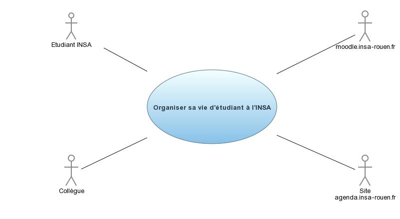
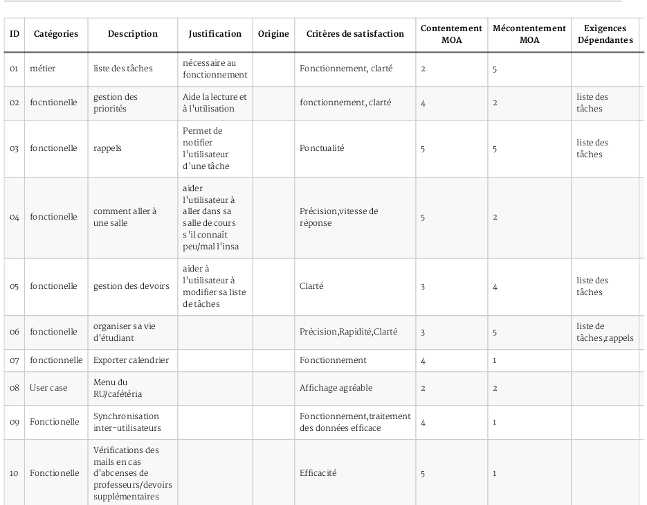

#I	Fondements du projet
##1. But du projet
###a. Problème de l’utilisateur ou contexte du projet 
A l'INSA de Rouen, les étudiants jonglent entre leurs cours, leurs devoirs, leur vie associatve et/ou personelle. Dans ce contexte les étudiants sont amenés à gérer de nombreuses tâches. Dans cet objectif, ils ont à leur disposition des outils tels que l'agenda des cours INSA, un agenda personel et peut-être des listes de tâches. Le problème est que pour gérer cette vie très active, les étudiants de l'INSA Rouen ne disposent pas d'outil spécifique leur étant destiné et doivent donc utiliser de nombreuses interfaces différentes pour gérer ce même problème d'organisation. 
###b. Objectifs du projet
L'objectif du projet est de développer et publier une application smartphone permettant à un éudiant de l'INSA Rouen d'organiser toute sa vie au même endroit. Cette application est du type "To-do list" mais se différencie des autres car étant spécifiquement conçue pour répondre aux besoins d'un étudiant de l'INSA Rouen. L'application fournit une liste de tâches par catégories et priorités avec une partie reservée aux devoirs. L'étudiant à la possibilité de filtrer ses taĉhes en fonction de ses besoins. Il dispose aussi d'un accès à l'agenda des cours, et peut instantanément voir le prochain cours qu'il va avoir. En installant cette application, l'étudiant doit pouvoir gérer la majorité de sa vie depuis celle-ci et ainsi éviter d'avoir à consulter d'autres applications ou l'agenda de l'INSA Rouen.
##2. Personnes et organismes impliqués dans les enjeux du projet
###a. Maître d’ouvrage
Département ASI de l'INSA Rouen.
###b. Acheteur
L'application sera disponible gratuitement au téléchargement.
##3. Utilisateurs du produit
###a.	Utilisateurs directs du produit
L'application est destinée et adaptée à tous les étudiants de l'INSA de Rouen. Elle est utilisable par n'importe qui en dehors de cet ensemble mais elle perd alors une partie de son intérêt. On peut donc s'attendre à plusieurs centaines d'utilisateurs. Le public est ainsi majoritairement composé de jeunes ayant probablement l'habitude d'utiliser les dernières technologies et qui seront donc en mesure de prendre en main l'application aisément.
###b. Priorité assignée aux utilisateurs
Les étudiants doivent pouvoir consulter rapidement ce dont ils ont besoin, l'application doit donc être très réactive pour qu'ils puissent voir leurs tâches prioritaires ou leur prochain cours en quelque secondes.
###c. Implication nécessaire de la part des utilisateurs dans le projet
En renseignant facultativement son profil d'étudiant (âge, département, groupe...), la fonctionalité d'agenda personnalisé et de vue du prochain cours devient accessible à l'utilisateur.
###d. Utilisateurs concernés par les opérations de maintenance du produit
L'application récupère les informations de l'agenda en ligne de l'INSA Rouen, le bon fonctionnement de l'affichage des cours dépend de l'INSA Rouen. Les développeurs de l'application doivent s'assurer que l'utilisateur ne rencontre pas de bugs pendant l'utilisation de l'application.
#II	Contraintes sur le projet 
##4. Contraintes non négociables
###a. Contraintes sur la conception de la solution

* L'application doit fonctionner sur n'importe quel téléphone Android version 4.0 et ultérieur ainsi que sous iOS 6 et ultérieur pour être utilisable par une grande partie des étudiants.
* L'application doit fonctionner et être utilisable sans connexion à internet, et dans ce cas, doit au moins proposer la gestion des tâches et la dernière version reçue de l'agenda de cours. Ainsi l'étudiant peut valider ou créer de nouvelles tâches même sans Internet.
* L'application doit contenir au moins une partie liste des tâches, une partie devoirs et un agenda. Le but étant de ne pas être embrouillé par une trop grosse quantité d'information. Ces parties sont encore divisible si besoin.
* L'application doit être utilisable sans renseigner d'informations personnelles si l'on ne le souhaite pas, mais dans ce cas, on ne peut pas obtenir des cours adaptés à son profil dans l'agenda.
* L'application permet de partager des tâches entre utilisateurs pour faciliter la collaboration.
* L'application permet à l'utilisateur d'exporter puis/ou d'importer des données pour amortir une éventuelle perte de données.
* L'agenda de cours doit pouvoir se synchroniser avec l'agenda du site au moins une fois par jour pour les changements d'horraires.

###b. Environnement de fonctionnement du système actuel
L'application est disponible sur le Play Store et l'Apple Store et permet donc des mises à jour. L'interface est donc adaptée à un écran de téléphone portable de type smartphone. Elle réceptionne et utilise l'information du site [agenda de l'INSA Rouen](agenda.insa-rouen.fr). Il est possible d'importer les données d'un autre utilisateur ou de partager des tâches avec lui.
###c. Applications « partenaires » (avec lesquelles le produit doit collaborer)
Le site [agenda de l'INSA Rouen](agenda.insa-rouen.fr) génère les emplois du temps des élèves. L'application est capable d'extraire les informations du site pour les inclure dans son propre agenda.
###d. Lieux de fonctionnement prévus
L'application fonctionne sur un smartphone que l'utilisateur peut donc utiliser n'importe où, egalement dans des endroits réclamant le calme, les sons sont donc à éviter.
###e. De combien de temps les développeurs disposent-ils pour le projet ?
Le délai acceptable de réalisation du projet est de 6 mois.
##5. Glossaire et conventions de dénomination
##6. Faits et hypothèses utiles
###a. Facteurs influençant le produit, mais qui ne sont pas des contraintes imposées sur les exigences

* L'application souhaite éviter à l'utilisateur d'utiliser plusieurs environnements différents pour organiser sa vie en décidant de réunir tout ce qui est important

###b. Hypothèses que l’équipe fait sur le projet 

* Aucun autre produit du même ne sera aussi spécifique que celui-ci
* Le produit pourrait être généralisé à toutes les INSA en fonction de son succès

#III	Exigences fonctionnelles
##7. Portée du travail
###a. La situation actuelle
###b. Contexte du travail
###c. Division du travail en événements métier
##8. Portée du produit (cas d’utilisations)
###a. Limites du produit : diagramme de cas d’utilisation

###b. Description sommaire des cas d’utilisation
##9. Exigences fonctionnelles et exigences sur les données
###a. Exigences fonctionnelles

#IV	Exigences non fonctionnelles
##10. Ergonomie et convivialité du produit
###a. L’interface
###b. Le style du produit (packaging inclus)
##11. Facilité d’utilisation et facteurs humains 
###a. Facilité d’utilisation
###b. Personnalisation et internationalisation
###c. Facilité d’apprentissage
###d. Facilité de compréhension et politesse
###e. Exigences d’accessibilité
##12. Fonctionnement du produit
###a. Rapidité d’exécution et temps de latence
###b. Exigences critiques de sûreté
###c. Précision et exactitude
###d. Fiabilité et disponibilité
###e. Robustesse ou tolérance à un emploi erroné
###f. Capacité de stockage et montée en charge
###g. Adaptation du produit à une augmentation de volume à traiter
###h. Longévité
##13. Adéquation du produit avec son environnement
###a. Environnement physique prévu
 L'application sera utilisée par des étudiants, pendant la période de cours concernant l'agenda, mais à n'importe quel moment pour les autres fonctionnalités. Elle sera l'outil qui permettra à tous les étudiants de l'INSA d'être à jour dans leur travail.
###b. Environnement technologique prévu
L'application sera concue pour un Smartphone lambda possédant système d'exploitation Android  Elle sera utilisée dans le protocole réseau HTPP(HyperText Transfer Protocol). 
###c. Applications « partenaires » (avec lesquelles le produit doit collaborer) 
L'application doit pouvoir fonctionner avec n'importe quel navigateur HTML et elle doit accéder aux données de la version précédente.
###d. Approche « produit » prêt à être commercialisé
##14. Maintenance, support, portabilité, installation du produit
###a. Maintenance du produit 
  * L'application doit pouvoir être gérée parles utilisateurs finaux.
  * On doit pouvoir ajouter les nouveau calendriers mis à jour par l'INSA.
###b. Conditions spéciales concernant la maintenance du produit
  * La nouvelle version de maintenance sera pour les utilisateurs finaux chaque année.
  * Chaque utilisateur aura l'accès en ligne sur le site de l'INSA.
###c. Exigences en matière de support
###d. Exigences de portabilité

  * L'application devra fonctionner sous un système Android.
  * Elle sera disponible sur le marché Android.
  
###e. Installation du système
##15. Sécurité
###a. Accès au système

  * Seuls les administrateurs de gestion de l'application peuvent avoir accès au données.
  
###b. Intégrité

  * Lors de mis à jour les utilisateurs auront les notifications à l'instant où cette mis à jour est disponible.
  * Toutes les personnes qui utilisent cette application auront accès aux mêmes informations les permettant d'être à jour.
  
###c. Protection des données à caractère personnel
###d. Audit et traçabilité
###e. Protection contre les infections
##16. Exigences culturelles et politiques 
###a. Exigences culturelles
###b Exigence politiques
##17. Lois et standards influençant le produit
###a. Conformité avec la loi
###b. Conformité avec des standards
